# HR Portal API Automation - Flow & Logic

## Project Overview

This document provides a comprehensive overview of the HR Portal API Automation project, including the complete flow logic and state diagrams using Mermaid.

---

## 1. Overall Test Execution Flow

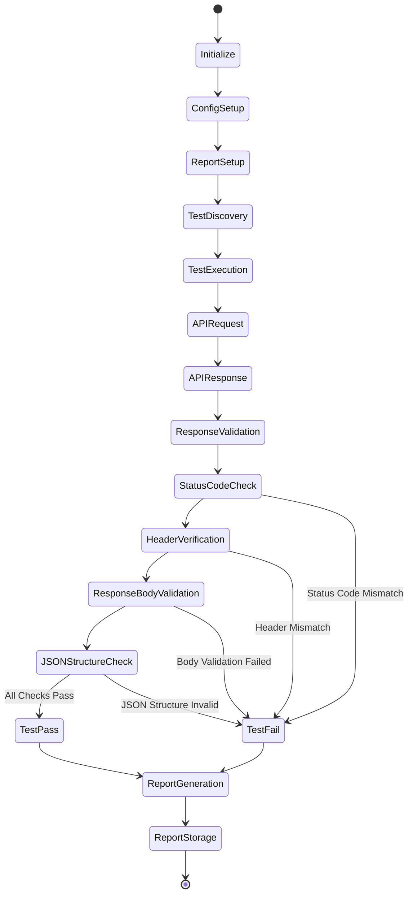

### Flow Description:
1. **Initialize**: Load pytest configuration and environment variables
2. **ConfigSetup**: Setup API constants, base URLs, and test markers
3. **ReportSetup**: Create timestamp-based report file
4. **TestDiscovery**: Pytest discovers all test cases from test files
5. **TestExecution**: Execute each test case sequentially
6. **APIRequest**: Make API call using the requests wrapper
7. **APIResponse**: Receive and parse API response
8. **ResponseValidation**: Validate all response attributes
9. **TestResult**: Mark as Pass or Fail based on validations
10. **ReportGeneration**: Generate HTML report with results
11. **ReportStorage**: Store report with timestamp

---

## 2. API Request & Response Cycle

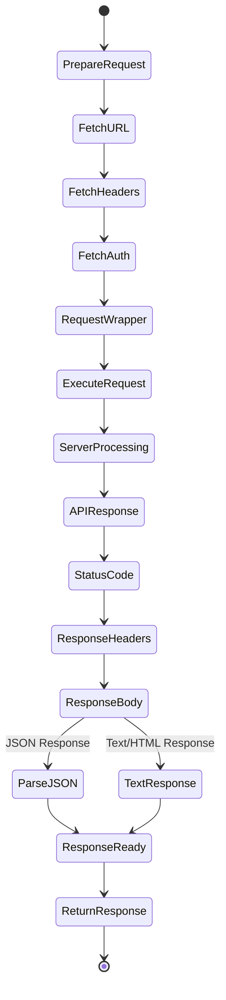

### API Request Components:
- **URL**: Constructed from `APIConstants` class (e.g., `/search_employee/`, `/employee_details/{code}`)
- **Auth**: Optional authentication (currently None for testing)
- **Headers**: Optional custom headers (Content-Type, etc.)
- **Method**: GET, POST, PATCH, PUT, DELETE (wrapper supports all)

### Response Handling:
- **Status Code**: HTTP response code (expected: 200, 400, 404, etc.)
- **Headers**: Response headers validation (Content-Type, etc.)
- **Body**: Raw response content
- **JSON Parsing**: Automatic parsing if `in_json=True` parameter is set

---

## 3. Test Verification Flow

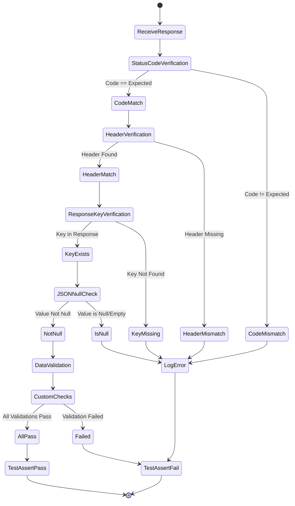

### Verification Types:

#### 1. **HTTP Status Code Verification**
```python
verify_http_status_code(response, expected_code)
# Asserts: response.status_code == expected_code
```

#### 2. **Response Header Verification**
```python
verify_response_header(response, header_name, expected_value)
# Asserts: response.headers.get(header_name) == expected_value
```

#### 3. **Response Key Verification**
```python
verify_response_key(actual_value, expected_value, key_name)
# Asserts: actual_value == expected_value
```

#### 4. **JSON Null Check**
```python
verify_json_key_not_null(key, key_name)
# Asserts: key is not None and key != ""
```

#### 5. **Numeric Value Verification**
```python
verify_json_key_gr_zero(key, key_name)
# Asserts: key > 0
```

---

## 4. Complete Test Execution State Machine

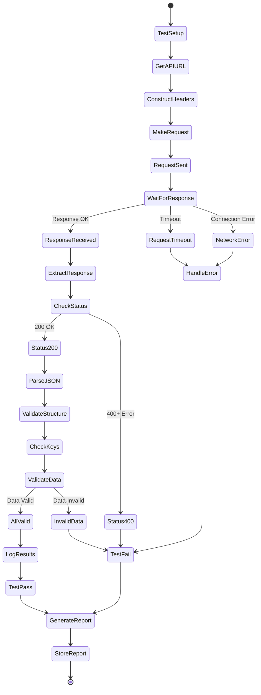

---

## 5. Test Case Structure & Flow

Each test case follows this pattern:

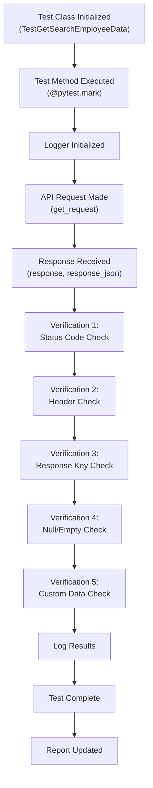

---

## 6. API Constants & URL Construction Flow

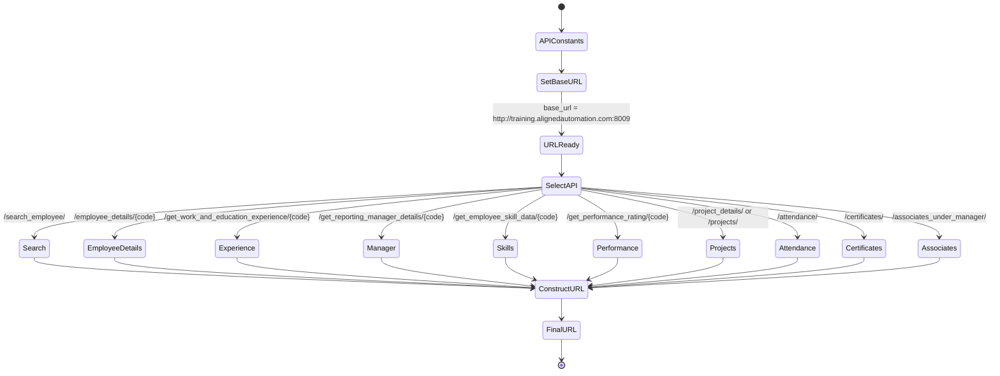

### Supported APIs:
| API | Endpoint | Method | Parameters |
|-----|----------|--------|------------|
| Search Employee | `/search_employee/` | GET | None |
| Employee Details | `/employee_details/{code}` | GET | employee_code |
| Work Experience | `/get_work_and_education_experience/{code}` | GET | employee_code |
| Reporting Manager | `/get_reporting_manager_details/{code}` | GET | employee_code |
| Employee Skills | `/get_employee_skill_data/{code}` | GET | employee_code |
| Performance Rating | `/get_performance_rating/{code}` | GET | employee_code |
| Project Details | `/project_details/` | GET | employee_code (optional) |
| Projects | `/projects/` | GET | None |
| Attendance | `/attendance/` | GET | None |
| Certificates | `/certificates/` | GET | employee_code (optional) |
| Associates | `/associates_under_manager/` | GET | employee_code (optional) |

---

## 7. Report Generation Flow

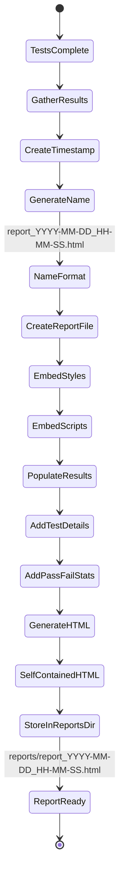

### Report Details:
- **Location**: `reports/` folder
- **Naming**: `report_YYYY-MM-DD_HH-MM-SS.html`
- **Format**: Self-contained HTML (all CSS/JS embedded)
- **Contents**:
  - Test summary (total, passed, failed)
  - Individual test results
  - Test duration
  - Error messages and stack traces
  - Response details (for debugging)

---

## 8. Project File Structure & Data Flow

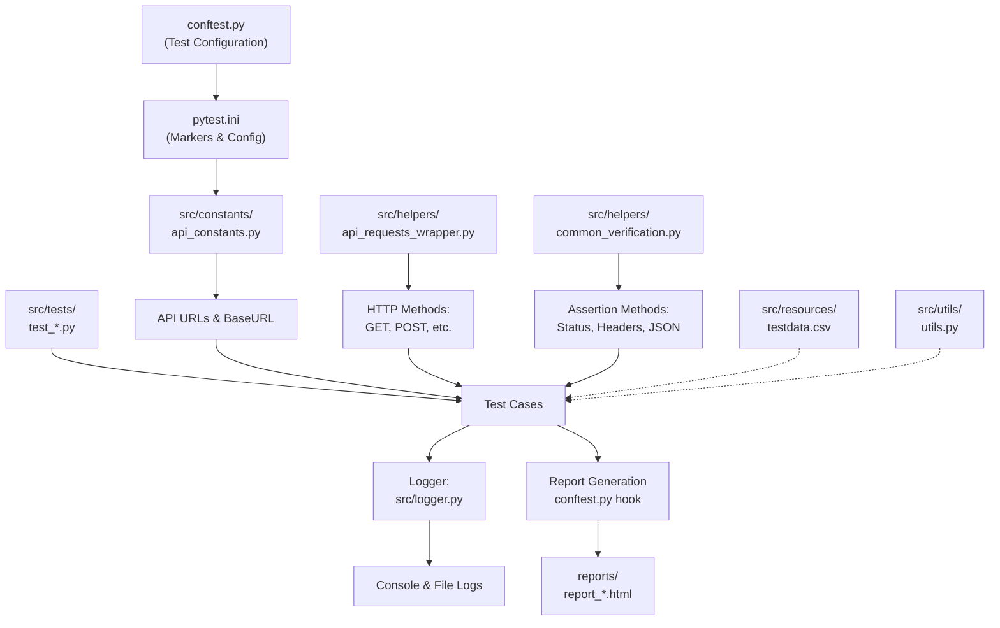

---

## 9. Error Handling Flow

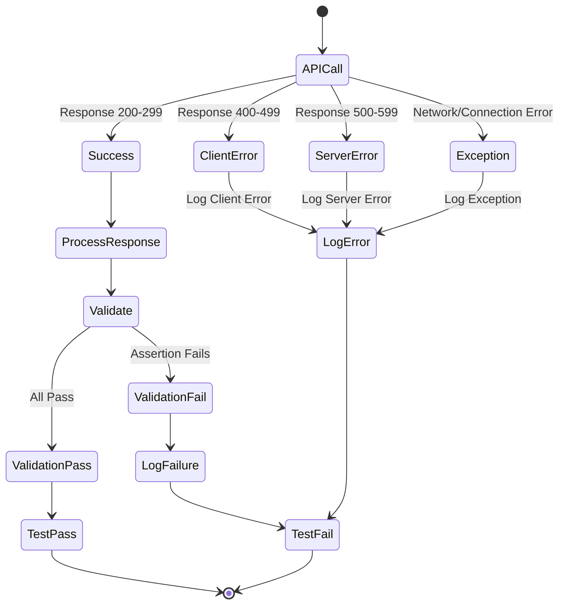

### Error Scenarios:
1. **Connection Error**: Network unreachable, DNS failure
2. **Timeout**: Request exceeds timeout threshold
3. **Client Error (4xx)**: Bad request, unauthorized, not found, etc.
4. **Server Error (5xx)**: Internal server error, service unavailable
5. **Validation Error**: Response doesn't match expected values
6. **JSON Parse Error**: Invalid JSON in response

---

## 10. Data Flow Between Components

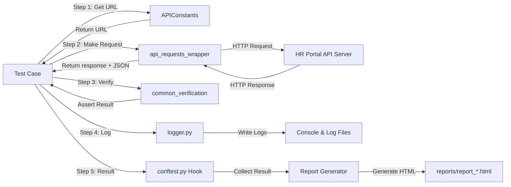

---

## 11. Test Execution Sequence Diagram

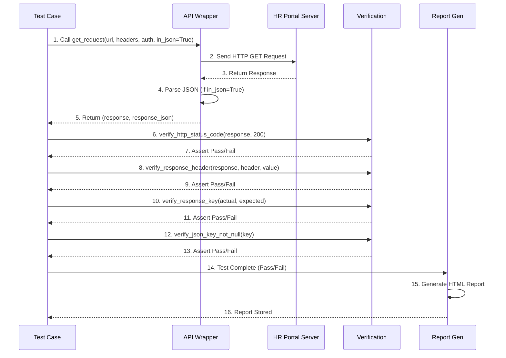

---

## 12. Key Components Summary

### **conftest.py** (Configuration)
- Configures pytest with dynamic report naming
- Creates timestamped report files
- Sets up report directory

### **api_constants.py** (API Configuration)
- Defines base URL: `http://training.alignedautomation.com:8009`
- Defines all API endpoint URLs
- Default employee code: `AASPL-1918`

### **api_requests_wrapper.py** (HTTP Wrapper)
- Provides `get_request()` method
- Supports optional JSON parsing
- Returns tuple of (response, response_json)

### **common_verification.py** (Assertions)
- `verify_http_status_code()`: Status validation
- `verify_response_header()`: Header validation
- `verify_response_key()`: Key-value validation
- `verify_json_key_not_null()`: Null checks
- `verify_json_key_gr_zero()`: Numeric validation

### **Test Cases** (test_*.py)
- Import required modules
- Create test class with pytest markers
- Define test methods
- Call API -> Get Response -> Verify -> Log

### **logger.py** (Logging)
- Provides structured logging
- Logs test execution flow
- Captures API responses and results

### **pytest.ini** (Markers)
- Defines pytest markers for test categorization
- Enables running tests by marker: `pytest -m Get_Search_Employee_Data`

---

## 13. Execution Commands

```bash
# Run all tests
pytest --html=reports/report.html --self-contained-html

# Run tests by marker
pytest -m Get_Search_Employee_Data --html=reports/report.html --self-contained-html

# Run specific test file
pytest src/tests/Training_Aligned_Automation_TestCases/01_Get_Search_Employee_Data_test.py --html=reports/report.html --self-contained-html

# Run with verbose output
pytest -v --html=reports/report.html --self-contained-html

# Run with logging
pytest -v -s --html=reports/report.html --self-contained-html
```

---

## Summary

The HR Portal API Automation framework follows a structured, modular approach:

1. **Configuration** (conftest.py, pytest.ini) sets up the test environment
2. **Constants** (api_constants.py) provide centralized API configuration
3. **Wrappers** (api_requests_wrapper.py) abstract HTTP complexity
4. **Verification** (common_verification.py) standardizes assertions
5. **Tests** (test_*.py) implement specific test scenarios
6. **Logging** (logger.py) tracks execution
7. **Reporting** (conftest.py hooks) generates timestamped HTML reports

Each test follows the **Arrange-Act-Assert** pattern:
- **Arrange**: Get API URL and prepare headers
- **Act**: Make API request via wrapper
- **Assert**: Verify response using common verification methods
- **Report**: Generate timestamped HTML report with results

